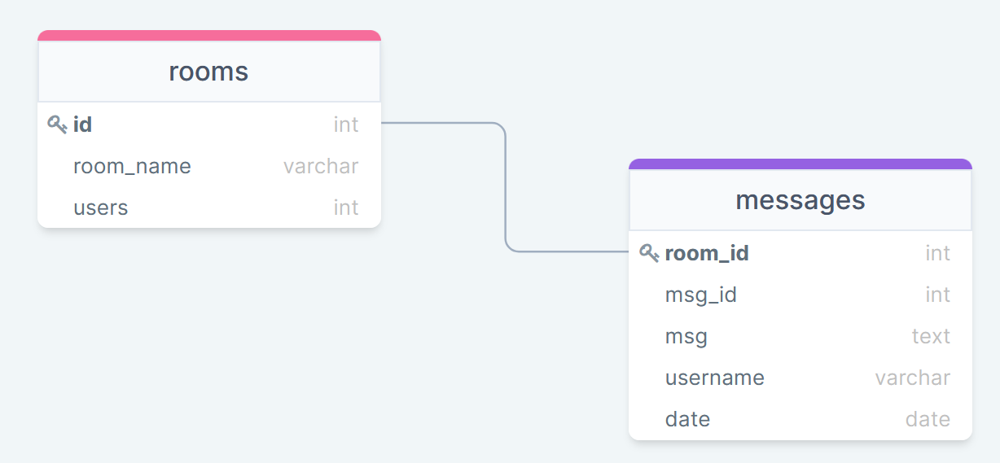

# Chat messenger using Socket.io

This is a simple chat messenger using Node.js and Typescript as the server backend. The web sockets were handled with the socket.io library. PostgreSQL was used to save messages and keep up with chat room data like the amount of people in a room, who is specifically in the room, etc. This was a simple personal project that I wanted to do.

## Building the project

Docker was used in this project as a learning experience. I wanted to learn containerization by using Docker and Docker Compose.

_Before running the container, check that the variables in the `.env` file are the same in the `docker-compose.yml`_

```
DB_USERNAME="postgres"
DB_PASSWORD="postgres"
DB_DATABASE="messenger"
DB_URL="db"
DB_PORT=5432
PORT=8080
```

After verifying the `.env` and `docker-compose.yml` files, run the command:

```
docker-compose up -d
```

and wait a few seconds for the containers to download and run.

From there, just connect to the website which should be located on `localhost:${your_env_port}`.

## Current Features

- Simple messaging like IRC
- Saved chat logs

## Possible features

- Saved usernames with passwords
- Private/hidden rooms with passwords
- Direct links to rooms
- Some security features
- List timezones and have them adjust per user
- Spam protection

## Technologies used

- Node.js
- Express
- Typescript
- Javascript/HTML/CSS
- Socket.io library
- PostgreSQL
- Docker
- Docker Compose
- Yarn

## PostgreSQL Database

There are two tables used for the PostgreSQL database. The schema looks something like this:



## Issues or Possible Ones

- Altering the sessionStorage can possibly cause issues since that's how the username is being saved
- Encrypt text for privacy reasons
